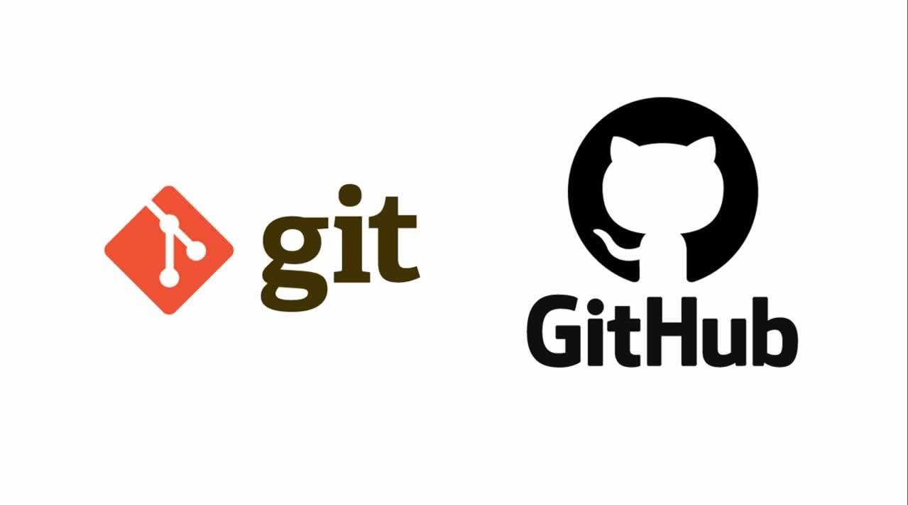

# heal

## Deployment 
[Heroku](https://elite-heal.herokuapp.com/)

## Wireframes

[Figma wireframing project workspace](https://www.figma.com/file/gVzSAVW4epMERfJriZd2cw/HEAL)

## User Stories

1. User Registration: As user, I want to to be able to sign up to the website, so I can use the service
2. Insurance: as an insurance company, I want to be able to access users' info related to threi medical history and treatments.
3. procedure review: as an insurance company, I want to review what the doctor assigned for the patient of medical preocedures, so that i can accept the coverage or not
4. bill transactions: As an accountant, I want to be able to access the patient's procedures, so I can confirm that the patients has paid the costs.
5. perform preocedure & terminate transactions: as a medical staff, I want to be able to see patient's transactions if they are confirmed or not, so that I can complete the preocedure and terminate the transaction
6. doctor visit: as a user, I want to see patient history ad info , so I can write the diagnoses related to the history and contact the insurance departement when I want to do a procedure for the patient
7. registratoin preview: As an admin, I want to be able to review of every registration process, so that I can accpet the user with the correct info

## Software Requirements

[Requirements Page](requirements.md)

## UML

## Database Entities

## Routes and flow diagrams
[routes & Data flow diagrams](routes-flow.md)

## Tests On Postman
[tests](tests.md)

## Tools 

## Tools and Technologies
- Languages: JavaScript, markdown
- Frameworks: express
- Runtime Environment: Node.js
- npm packages: superagent, dotenv, mpngoose, @code-fellows/supergoose, jest , jsonwebtoken, socket.io, socket.io-client, moment, method-override, base-64, bcrypt
- Tools: VSCode, Git, GitHub, Postman, WSL, rimo whitboard, Slack, Zoom
